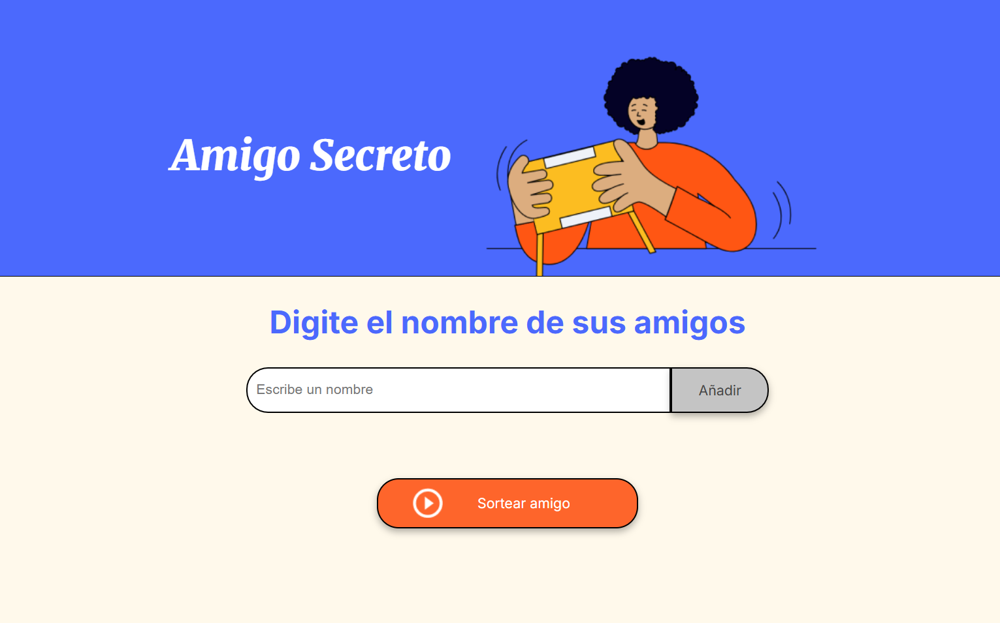
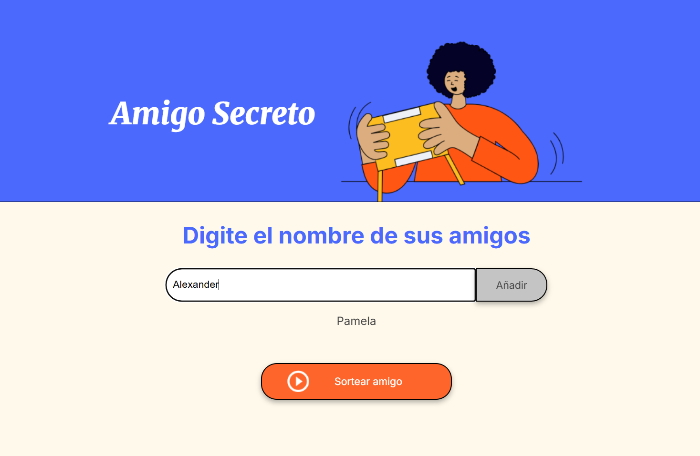
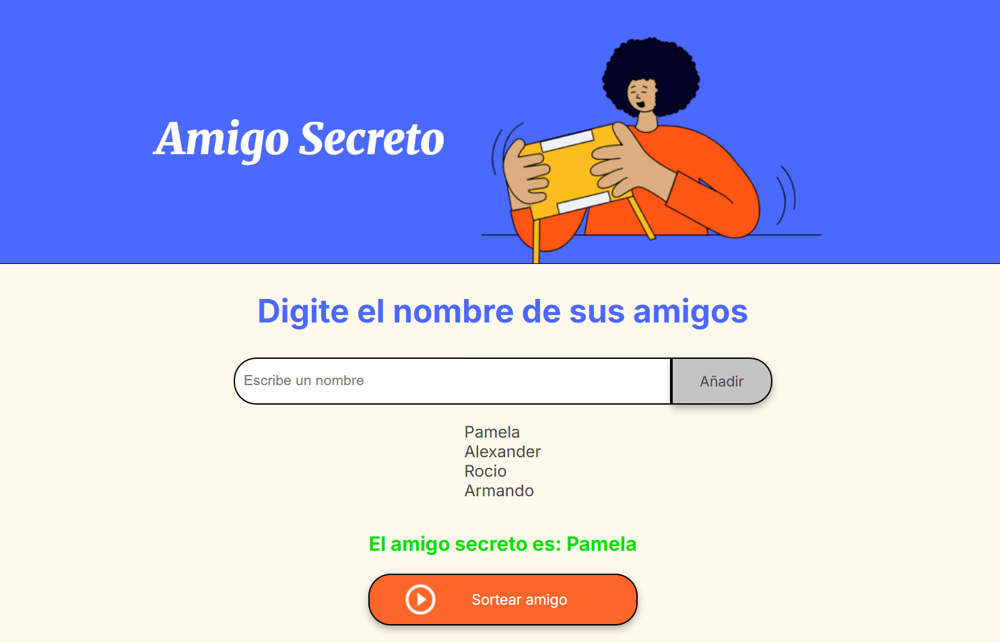

# Amigo Secreto 🎉

¡Hola! 😊 Este es mi proyecto del **Challenge de Amigo Secreto**. Es un pequeño juego donde puedes escribir los nombres de tus amigos y sortear quién será el amigo secreto. Es súper divertido y fácil de usar. ¡Espero que te guste! 💖

## ¿Cómo funciona? 🤔

### Paso 1: Introducir los nombres
Primero, escribe el nombre de tus amigos en el campo de texto y haz clic en el botón **"Añadir"**. Cada vez que agregues un nombre, aparecerá en la lista de amigos. 

---

### Paso 2: Ver la lista de amigos
A medida que agregas nombres, se irán mostrando en una lista. Así puedes asegurarte de que todos los nombres están incluidos antes de hacer el sorteo.

---

### Paso 3: Sortear el amigo secreto
Cuando tengas todos los nombres en la lista, haz clic en el botón **"Sortear amigo"**. El juego seleccionará un nombre al azar y te mostrará quién es el amigo secreto.

---

## Tecnologías utilizadas 🛠️

Este proyecto está hecho con:

- **HTML**: Para la estructura de la página.
- **CSS**: Para los estilos y diseño bonito. 🌈
- **JavaScript**: Para la lógica del juego.

## Archivos principales 📂

- `index.html`: Contiene la estructura del juego.
- `style.css`: Define los colores, fuentes y estilos.
- `app.js`: Aquí está toda la lógica para agregar nombres y sortear el amigo secreto.

## Cómo probarlo 🚀

1. Descarga o clona este repositorio.
2. Abre el archivo `index.html` en tu navegador.
3. ¡Empieza a jugar con tus amigos! 🎉

## Notas finales ✨

Este proyecto es parte de mi aprendizaje en programación. Me ayudó a practicar lógica, manipulación del DOM y diseño web. Si tienes alguna sugerencia o mejora, ¡me encantaría escucharla! 😊

---

¡Gracias por visitar mi proyecto! 💕
